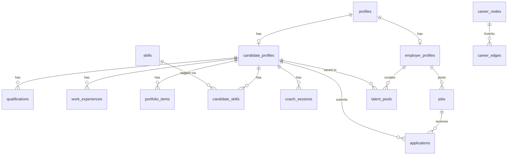

# Database Schema

Data model referenced by [`ARCHITECTURE.md`](./ARCHITECTURE.md)'s Storage Model section. Keep both in sync, this file owns the detail, ARCHITECTURE.md owns the one-line summary. Source of truth: `supabase/migrations/`.

## Tables

### profiles
| Column | Type | Constraints | Notes |
| --- | --- | --- | --- |
| id | uuid | primary key | |
| user_id | uuid | FK → auth.users.id, not null, unique | |
| role | text | not null, check in (candidate, employer) | |
| created_at | timestamptz | default now() | |

### candidate_profiles
| Column | Type | Constraints | Notes |
| --- | --- | --- | --- |
| id | uuid | primary key | |
| profile_id | uuid | FK → profiles.id, not null, unique | |
| name | text | not null | |
| location, bio, github_url, linkedin_url | text | | |
| seeking | text | not null, check in (internship, full_time) | |
| job_title | text | | |
| years_exp | int | check >= 0 | |
| is_public | boolean | not null, default true | added migration 005, gates public portfolio visibility |
| resume_url | text | | added migration 010 |
| created_at, updated_at | timestamptz | default now() | updated_at has a trigger |

### skills
| Column | Type | Constraints | Notes |
| --- | --- | --- | --- |
| id | uuid | primary key | |
| name | text | not null, unique | |
| category | text | not null | |

### candidate_skills
| Column | Type | Constraints | Notes |
| --- | --- | --- | --- |
| id | uuid | primary key | |
| candidate_id | uuid | FK → candidate_profiles.id | |
| skill_id | uuid | FK → skills.id | |
| level | text | not null, check in (beginner, mid, senior) | |
| verified | boolean | default false | |
| | | unique (candidate_id, skill_id) | |

### qualifications
| Column | Type | Constraints | Notes |
| --- | --- | --- | --- |
| id | uuid | primary key | |
| candidate_id | uuid | FK → candidate_profiles.id | |
| type | text | not null, check in (education, certificate) | |
| institution, title | text | not null | |
| field_of_study, grade | text | | |
| start_date, end_date | date | | |
| is_current | boolean | default false | |
| document_url | text | | column exists, no upload flow yet |
| credential_url | text | | added migration 004 |
| created_at | timestamptz | default now() | |

### work_experiences
| Column | Type | Constraints | Notes |
| --- | --- | --- | --- |
| id | uuid | primary key | |
| candidate_id | uuid | FK → candidate_profiles.id | |
| company, title | text | not null | |
| location | text | | |
| start_date | date | not null | |
| end_date | date | | |
| is_current | boolean | default false | |
| description | text | | |
| employment_type | text | not null, check in (full_time, part_time, internship, contract) | |
| document_url | text | | |
| created_at | timestamptz | default now() | |

### portfolio_items
| Column | Type | Constraints | Notes |
| --- | --- | --- | --- |
| id | uuid | primary key | |
| candidate_id | uuid | FK → candidate_profiles.id | |
| title | text | not null | |
| description, url | text | | |
| tags | text[] | default '{}' | |
| date | date | | |
| created_at | timestamptz | default now() | |

### coach_sessions
| Column | Type | Constraints | Notes |
| --- | --- | --- | --- |
| id | uuid | primary key | |
| candidate_id | uuid | FK → candidate_profiles.id | |
| messages | jsonb[] | default '{}' | table exists, route never reads/writes it - Coach has no cross-session memory yet |
| created_at, updated_at | timestamptz | default now() | updated_at has a trigger |

### career_nodes
| Column | Type | Constraints | Notes |
| --- | --- | --- | --- |
| id | uuid | primary key | |
| title | text | not null, unique | |
| level | text | not null, check in (entry, mid, senior, lead, executive) | |
| avg_salary_myr_min, avg_salary_myr_max | int | not null | |
| typical_years_in_role | int | not null, default 2 | |
| category | text | not null | Engineering, Data, AI/ML, Product, Design, Business, Marketing, Sales |
| description | text | | |

### career_edges
| Column | Type | Constraints | Notes |
| --- | --- | --- | --- |
| id | uuid | primary key | |
| from_node_id, to_node_id | uuid | FK → career_nodes.id | |
| avg_transition_months | int | not null, default 12 | |
| skill_gaps | text[] | default '{}' | |
| | | unique (from_node_id, to_node_id) | |

### salary_data
| Column | Type | Constraints | Notes |
| --- | --- | --- | --- |
| id | uuid | primary key | |
| role, location, experience_band | text | not null | experience_band must match one of 5 UI bands: Intern, 0-2 years, 2-5 years, 5-8 years, 8+ years (`components/FairPayEngine.tsx`) |
| p25, p50, p75 | int | not null | |
| source | text | not null, default 'Path OS estimate' | rebranded from 'Talentbank 2025' in migration 009 |
| year | int | not null, default 2025 | |

### employer_profiles
| Column | Type | Constraints | Notes |
| --- | --- | --- | --- |
| id | uuid | primary key | |
| profile_id | uuid | FK → profiles.id, not null, unique | |
| company_name | text | not null | |
| industry, size, website | text | | |
| created_at | timestamptz | default now() | |

### jobs
| Column | Type | Constraints | Notes |
| --- | --- | --- | --- |
| id | uuid | primary key | |
| employer_id | uuid | FK → employer_profiles.id | |
| title, location | text | not null | |
| salary_min, salary_max | int | | |
| required_skills | text[] | default '{}' | |
| description | text | | |
| employment_type | text | not null, check in (full_time, part_time, internship, contract) | |
| status | text | not null, default 'open', check in (open, closed, draft) | |
| created_at | timestamptz | default now() | |

### applications
| Column | Type | Constraints | Notes |
| --- | --- | --- | --- |
| id | uuid | primary key | |
| job_id | uuid | FK → jobs.id | |
| candidate_id | uuid | FK → candidate_profiles.id | |
| status | text | not null, default 'applied', check in (applied, reviewed, shortlisted, offered, rejected) | pipeline stage |
| applied_at | timestamptz | default now() | |
| notes | text | | |
| | | unique (job_id, candidate_id) | prevents duplicate applications |

### talent_pools
| Column | Type | Constraints | Notes |
| --- | --- | --- | --- |
| id | uuid | primary key | |
| employer_id | uuid | FK → employer_profiles.id | |
| candidate_id | uuid | FK → candidate_profiles.id | |
| source | text | not null, check in (applied, scouted, alumni) | |
| added_at | timestamptz | default now() | |
| | | unique (employer_id, candidate_id) | |

### storage.objects (`resumes` bucket)
Private bucket, `public: false`. Objects keyed `{user_id}/resume.{ext}`. RLS is a path-prefix ownership check (`storage.foldername(name))[1] = auth.uid()::text`), not a join back through `candidate_profiles`/`profiles`.

## Relationships

- `profiles` → `candidate_profiles` / `employer_profiles`: one-to-one, role-specific profile data
- `candidate_profiles` → `qualifications` / `work_experiences` / `portfolio_items` / `candidate_skills` / `coach_sessions`: one-to-many, owned candidate data
- `skills` ↔ `candidate_profiles` via `candidate_skills`: many-to-many, with a `level`
- `career_nodes` ↔ `career_nodes` via `career_edges`: many-to-many, directed (career transitions with a skill-gap list)
- `employer_profiles` → `jobs`: one-to-many
- `jobs` ↔ `candidate_profiles` via `applications`: many-to-many, with a pipeline `status`
- `employer_profiles` ↔ `candidate_profiles` via `talent_pools`: many-to-many, with a `source`

## ERD

## RLS Policies

- **profiles**: owner-only, full access (`user_id = auth.uid()`)
- **candidate_profiles**: owner full access; public/authenticated select gated on `is_public = true` (migration 005 - replaced an earlier blanket `using (true)`)
- **qualifications / work_experiences / candidate_skills / portfolio_items / coach_sessions**: owner-only, full access, joined through `candidate_profiles` → `profiles`. No public-read policy - non-owners reach this data only via `get_public_portfolio`.
- **career_nodes / career_edges / salary_data / skills**: public select (`using (true)`); `skills` also allows authenticated insert/update (migrations 011/012 - the RLS policy alone 42501'd until the matching table `GRANT` was added)
- **employer_profiles**: owner full access; public select gated through `employer_is_hiring(id)`, a `SECURITY DEFINER` function (migration 008 - a direct subquery on `jobs` caused RLS recursion, since `jobs`'s own policy subqueries `employer_profiles`)
- **jobs**: employer full access to own; public select where `status = 'open'`
- **applications**: full access to either the owning candidate or the job's owning employer
- **talent_pools**: owner (employer) full access
- **storage.objects (resumes bucket)**: authenticated, path-prefix ownership (`{user_id}/...`) for select/insert/update/delete

Public reads that cross ownership boundaries (portfolio page, job's employer name) never use a table grant to `anon` - see `get_public_portfolio` and `employer_is_hiring` below.

## Definer Functions

- **`get_public_portfolio(p_id uuid)`** - returns one candidate's full public portfolio as jsonb, only if `is_public = true`. `SECURITY DEFINER`, execute granted to `anon, authenticated`, no table grant. Backs `/p/[candidateId]`.
- **`employer_is_hiring(p_employer_id uuid)`** - returns whether an employer has an open job. `SECURITY DEFINER`, execute granted to `anon, authenticated`. Backs the `employer_profiles: public read when hiring` policy without causing RLS recursion with `jobs`.

## Migrations

| Migration | Reason |
| --- | --- |
| 001_initial_schema | Base schema: all core tables, RLS enabled + owner policies, `updated_at` trigger |
| 002_seed_data | Seed data (career nodes/edges, salary benchmarks) |
| 003_service_role_grants | `service_role` needs explicit grants even with RLS enabled - not automatic |
| 004_credential_url | Add `credential_url` to `qualifications`, grant `service_role` full access on it |
| 005_portfolio_visibility | Add `candidate_profiles.is_public`; replace blanket employer-read with the flag; add `get_public_portfolio` definer RPC for safe public reads |
| 006_expand_career_graph | Add more career nodes/edges/salary rows (Marketing and Sales tracks, engineering/data/design depth roles) |
| 007_employer_profiles_public_read | Add public-read policy on `employer_profiles` gated on having an open job (fixes jobs list showing "Company" for every listing) |
| 008_fix_employer_profiles_recursion | Fix Postgres 42P17 infinite recursion from 007 by moving the check into `employer_is_hiring()`, a `SECURITY DEFINER` function |
| 009_fix_salary_source_branding | Rebrand `salary_data.source` from "Talentbank 2025" to "Path OS estimate" |
| 010_resume_storage | Private `resumes` storage bucket, path-prefix-owned RLS policies, add `candidate_profiles.resume_url` |
| 011_skills_insert_policy | Add authenticated insert policy on `skills` (was select-only) |
| 012_skills_insert_grant | Add the matching table `GRANT` - the RLS policy from 011 alone still failed with 42501, since a table `GRANT` is a separate gate from RLS |
